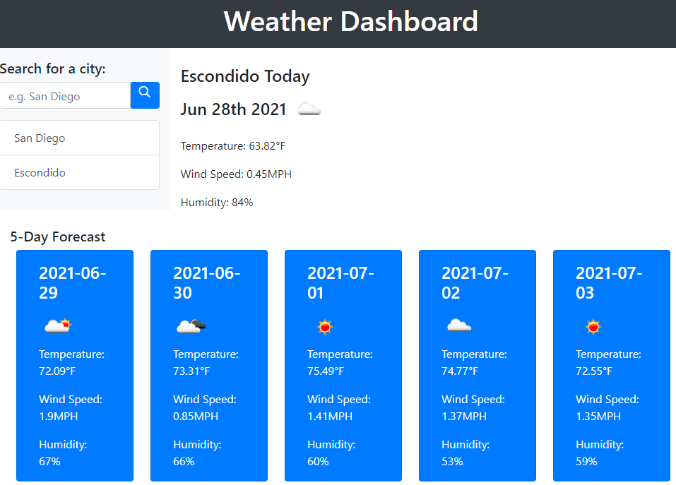
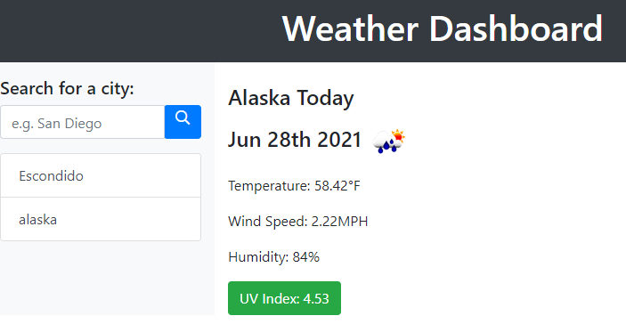
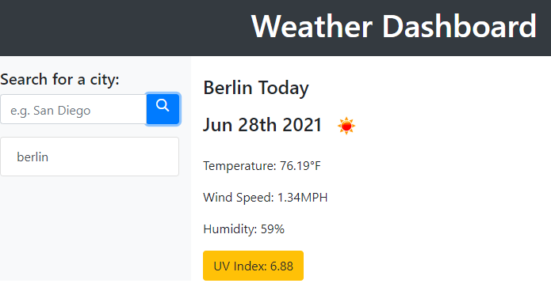
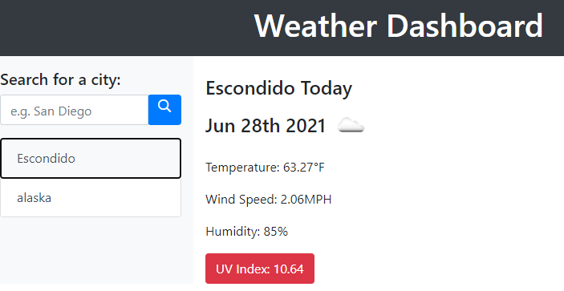
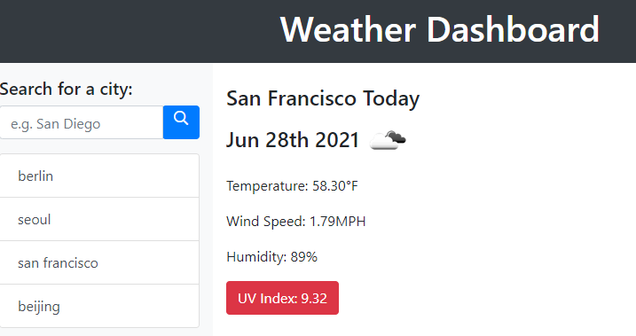

# Weather Dashboard
Do you want to search weather for your favorite cities?
Come to my [**Weather Dashboard**](https://zzangu0215.github.io/Weather_Dashboard/) to be a forecaster!

## Features

1. If you **SEARCH** for a city,
    - You can see the **CURRENT** weather details.
    - You can see the weather forecasts for upcoming **5 days**.
    - The search history is automatically added to the lists.

    

2. You can see the **UV Index** indicating with different colors based on its level. 
    - If **UV Index** is greater than 8.5, it's indicated as **RED**.
    - IF **UV Index** is less than 8.5, but greater than 5, it's indicated as **YELLOW**.
    - IF **UV Index** is less than 5, it's indicated as **GREEN**.

    |  |  | 
    |----|----|
    |  |  | 

## Demo Video

Here is the [**Demo Video Link**](https://youtu.be/LpLV8uF9pLg)

## Author

- **Jun Park**
    - Portfolio: [**Portfolio**](https://zzangu0215.github.io/portfolio/) (to be updated)
    - Email: tajo0215@gmail.com
    - SNS: https://www.instagram.com/o0ojunny/